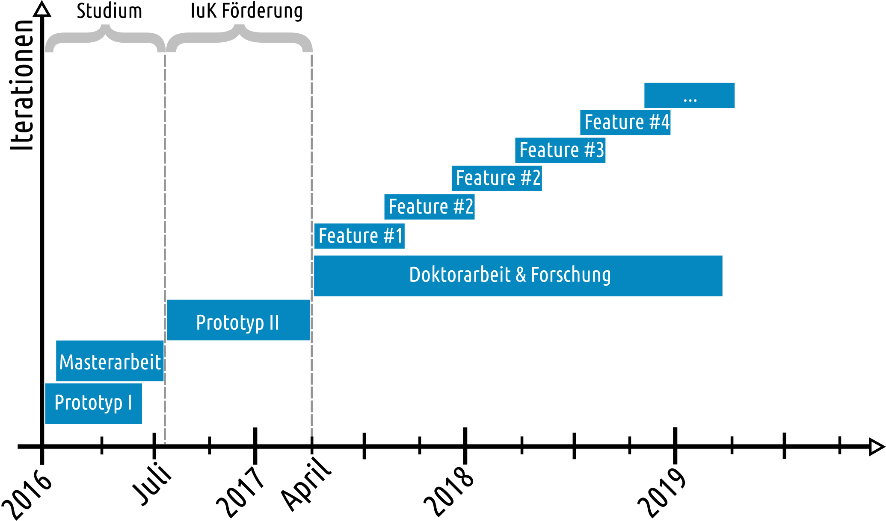

\newpage
\pagenumbering{arabic} 
\setcounter{page}{1}

# Zusammenfassung der Projektziele

Ziel des Projektes ist die Entwicklung einer sicheren und dezentralen
Alternative zu Cloud--Storage Lösungen wie Dropbox, die sowohl für Unternehmen
als auch für Heimanwender nutzbar ist. Trotz der Prämisse, einfache Nutzbarkeit
zu gewährleisten, wird auf Sicherheit sehr großen Wert gelegt.  Aus Gründen der
Transparenz wird die Software mit dem Namen »``brig``« dabei quelloffen unter der
``AGPL`` Lizenz entwickelt.

Nutzbar soll das resultierende Produkt, neben dem Standardanwendungsfall der
Dateisynchronisation, auch als Backup- bzw. Archivierungs-lösung sein
beziehungsweise auch als verschlüsselter Daten--Safe oder als Plattform für
andere, verteilte Anwendungen (wie beispielsweise aus dem Industrie 4.0 Umfeld).

# Projektsteckbrief

## Einleitung

Viele Unternehmen haben sehr hohe Ansprüche an die Sicherheit, welche zentrale
Alternativen wie Dropbox[^Dropbox] nicht bieten können. Zwar wird die
Übertragung von Daten zu den zentralen Dropbox-Servern verschlüsselt, was
allerdings danach mit den Daten »in der Cloud« passiert liegt nicht mehr in
der Kontrolle der Nutzer. Dort sind die Daten schonmal für andere Nutzer wegen
Bugs einsehbar oder werden gar von Dropbox an amerikanische Geheimdienste
weitergegeben. 

TODO: Links raussuchen.

[^Dropbox]: Mehr Informationen unter \url{https://www.dropbox.com/}

[Sprichwörtlich, regnen die Daten irgendwo anders aus der Cloud ab.] Tools wie
Boxcryptor[^Boxcryptor] lindern diese Problematik zwar etwas, heilen aber nur
die Symptome, nicht das zugrunde liegende Problem.

[^Boxcryptor]: Krypto-Layer für Cloud-Dienste, siehe \url{https://www.boxcryptor.com/de}

Dropbox ist leider kein Einzelfall -- beinahe alle Cloud--Dienste haben, oder
hatten, architektur-bedingt ähnliche Sicherheitslecks. Für ein Unternehmen wäre
es vorzuziehen ihre Daten auf Servern zu speichern, die sie selbst
kontrollieren. Dazu gibt es bereits einige Werkzeuge wie *ownCloud* oder 
Netzwerkdienste wie *Samba*, doch technisch bilden diese nur die zentrale
Architektur von Cloud--Diensten innerhalb eines Unternehmen--Netzwerks ab. 

## Ziele

Ziel ist die Entwicklung einer sicheren, dezentralen und unternehmenstauglichen
Dateisynchronisationssoftware names ``brig``. Die »Tauglichkeit« für ein
Unternehmen ist sehr variabel. Wir meinen damit im Folgenden diese Punkte:

- *Einfach Benutzbarkeit für nicht-technische Angestellte:* Sichtbar soll nach der
  Einrichtung nur ein simpler Ordner im Dateimanager sein.
- *Effiziente Übertragung von Dateien:* Intelligentes Routing vom Speicherort zum Nutzer.
- *Speicherquoten:* Nur relevante Dateien müssen synchronisiert werden.
- *Automatische Backups:* Versionsverwaltung auf Knoten mit großem Speicherplatz.
- *Schnelle Auffindbarkeit:* Kategorisierung durch optionale Verschlagwortung.

Um eine solche Software entwickeln, wollen wir auf bestehende Komponenten wie
dem InterPlanetaryFileSystem (kurz ``ipfs``, ein flexibles P2P
Netzwerk[@peer2peer]) und XMPP (ein Messenging Protokoll und Infrastruktur,
siehe [@xmpp]) aufsetzen. Dies erleichtert unsere Arbeit und macht einen
Prototyp der Software vom Aufwand erst möglich. 

Von einem Prototypen zu einer marktreifen Software ist es allerdings stets ein
weiter Weg. Daher wollen wir einen großen Teil der Zeit nach dem Prototyp damit
verbringen, die Software bezüglich Sicherheit, Performance und einfacher
Benutzerfreundlichkeit zu optimieren. Da es dafür nun mal keinen
standardisierten Weg gibt, ist dafür ein großes Maß an Forschung nötig.

## Einsatzmöglichkeiten

``brig`` soll deutlich flexibler nutzbar sein als beispielsweise zentrale
Dienste. Nutzbar soll es unter anderem sein als…

- **Synchronisationslösung**: Spiegelung von 2-n Ordnern.
- **Transferlösung**: »Veröffentlichen« von Dateien nach Außen mittels Hyperlinks.
- **Versionsverwaltung**: 
  Alle Zugriffe an eine Datei werden aufgezeichnet.
  Bis zu einer bestimmten Tiefe können alte Dateien abgespeichert werden.
- **Backup- und Archivierungslösung**: Verschiedene Knoten Typen möglich.
- **verschlüsselten Safe**: ein »Repository« kann »geschlossen« werden und später
  wieder »geöffnet« werden.
- **Semantisch durchsuchbares** tag basiertes Dateisystem[^TAG].
- als **Plattform** für andere Anwendungen.
- einer beliebigen Kombination der oberen Punkte.

[^TAG]: Mit einem ähnlichen Ansatz wie \url{https://en.wikipedia.org/wiki/Tagsistant}

## Zielgruppen

``brig`` zielt hauptsächlich auf Unternehmenskunden und Heimanwender.
Daneben sind aber auch noch andere Zielgruppen denkbar.

### Unternehmen

Großunternehmen können ``brig`` nutzen, um ihre Daten und Dokumente intern zu
verwalten. Besonders sicherheitskritische Dateien entgehen so der Lagerung in
Cloud Services oder der Gefahr von zig Kopien auf Mitarbeiter-Endgeräten.
Größere Unternehmen verwalten dabei meist ein Rechenzentrum auf den
firmeninterne Dokumente gespeichert werden. Diese werden dann meist mittels
ownCloud, Samba o.ä. von den Nutzern »manuell« heruntergeladen. 

In diesem Fall könnte man ``brig`` im Rechenzentrum und allen Endgeräten installieren.
Das Rechenzentrum würde die Datei mit tiefer Versionierung und vollem Caching vorhalten.
Endanwender würden alle Daten sehen, aber auf ihren Gerät nur die Daten tatsächlich
speichern, die sie auch benutzen. Hat ein Kollege im selben Büro beispielsweise die
Datei bereits kann ``brig`` sie dann auch teilweise von ihm holen.

Kleinunternehmen wie Ingenieurbüros können ``brig`` dazu nutzen Dokumente nach
außen freizugeben, ohne dass sie dazu vorher irgendwo »hochgeladen« werden
müssen. 

### Privatpersonen / Heimanwender

Heimanwender können ``brig`` für ihren Datenbestand aus Fotos, Filmen, Musik und
sonstigen Dokumenten nutzen. Ein typischer Anwendungsfall wäre dabei auf einem
NAS Server, der alle Dateien mit Versionierung speichert. Endgeräte wie Laptops
und Smartphones würde dann ebenfalls ``brig`` nutzen, aber mit deutlich
geringeren Speicherquotas.

### Plattform für industrielle Anwendungen

Da ``brig`` auch komplett automatisiert ohne Interaktion nutzbar sein soll,
kann es auch als Plattform für jede andere Anwendungen genutzt werden, die Dateien
austauschen und synchronisieren müssen.

Eine Anwendung in der Industrie 4.0 wäre beispielweise die Synchronisierung von Konfigurationsdateien im gesamten Netzwerk.

### Einsatz im öffentlichen Bereich

Aufgrund seiner Transparenz und einfachen Benutzbarkeit wäre ebenfalls eine
Nutzung an Schulen, Universitäten oder auch in Behörden zum Dokumentenaustausch
denkbar. Vorteilhaft wäre hierbei vor allem, dass man sich aufgrund des
Open--Source Modells an keinen Hersteller bindet (Stichwort: Vendor Lock) und
keine behördlichen Daten in der »Cloud« landen.

## Innovation

Die Innovation bei unserem Projekt  besteht daher darin bekannte Technologien
»neu zusammen zu stecken«, woraus sich viele neue Möglichkeiten ergeben.
Wie im nächsten Kapitel beleuchtet wird, ist ``brig`` die Synthese vieler
guter, bestehender und praxisgeprüfter Ideen in einem konsistenten Programm.

# Stand der Technik

## Stand der Wissenschaft

Zwar ist das Projekt stark anwendungsorientiert, doch basiert es auf gut
erforschten Technologien wie Peer-to-Peer-Netzwerken (kurz P2P, siehe auch
[@peer2peer_arch]), von der NIST[^NIST] zertifizierten kryptografischen
Standard-Algorithmen[@everyday_crypto] und verteilten Systemen im Allgemeinen
(wie der freie XMPP Standard). Peer to Peer Netzwerke wurden in den letzten
Jahren gut erforscht und haben sich auch in der Praxis bewährt (Skype ist ein
Beispiel für ein kommerzielles P2P Netzwerk, siehe
auch @peer2peer, S.2). 

Allerdings ist uns keine für breite Massen nutzbare Software bekannt, die es
Nutzern ermöglicht selbst ein P2P Netzwerk aufzuspannen und darin Dateien
auszutauschen. Am nähsten kommen dabei die beiden Softwareprojekte
``Syncthing`` (OpenSource) und ``BitTorrent Sync`` (proprietär).

Der wissenschaftliche Beitrag unserer Arbeit wäre daher die Entwicklung einer
freien Alternative, die von allen eingesehen, auditiert und studiert werden
kann. Diese freie Herangehensweise ist insbesondere für sicherheitskritische
Software relevant, da keine offensichtlichen »Exploits« in die Software
eingebaut werden können.

[^NIST]: NIST: *National Institute of Standards and Technology*

TODO: Repository und ähnliche begriffe einführen?

## Markt und Wettbewerber

Bereits ein Blick auf Wikipedia[@wiki_filesync] zeigt, dass der momentane Markt an
Dateisynchronisationssoftware (im weitesten Sinne) sehr unübersichtlich ist.

Bei einem näheren Blick stellt sich oft heraus, dass die Software dort oft nur
in Teilaspekten gut funktioniert oder andere nicht lösbare Probleme besitzt.

### Verschiedene Alternativen

Im Folgenden geben wir eine Auswahl von bekannten Dateisynchronisations
Softwares im weitesten Sinne. Nicht alle stehen davon in direkter Konkurrenz
zu ``brig``, aber viele Usecases überlappen sich.

#### Dropbox + Boxcryptor

Der vermutlich bekannteste und am weitesten verbreiteste Dienst zur
Dateisynchronisation. Verschlüsselung kann man mit Tools wie ``encfs`` oder das
proprietäre *Boxcryptor*. Es handelt sich um ein zentralen Dienst mit Servern in
Amerika. Was das Backend tut ist Geheimnis von Dropbox --- das Backend ist nicht
Open--Source.

#### Owncloud

Unter anderen aus diesen Gründen entstand die Open--Source Lösung Owncloud.
Nutzer hosten auf ihren Servern selbst eine ownCloud--Instanz und stellen
ausreichend Speicherplatz bereit. Vorteilhaft ist also, dass die Daten auf den
eigenen Servern liegt. Nachteilig hingegen, dass das zentrale Modell von Dropbox
lediglich auf eigene Server übertragen wird. Die Daten müssen zudem von einer
Weboberfläche geholt werden und nicht in einem »magischen«,
selbst-synchronisierten Ordner.

#### Syncthing

Das 2013 veröffentliche quelltextfreie *Syncthing* versucht diese zentrale
Instanz zu vermeiden, indem die Daten jeweils von Peer zu Peer übertragen
werden. Es ist allerdings kein vollständiges Peer--to--peer--Netzwerk, geteilte
Dateien liegen immer als Kopie bei allen Teilnehmern, die die Datei haben.

Besser als bei ownCloud ist hingegen gelöst, dass ein »magischer« Ordner
existiert in dem man einach Dateien legen kann, um sie zu teilen. Zudem wird die
Datei vom nächstgelegenen Knoten übertragen. Praktisch ist auch, dass
*Syncthing* Instanzen mittels eines zentralen Discovery--Servers entdeckt werden
können.

Nachteilig hingegen ist die fehlende Benutzerverwaltung: Man kann nicht
festlegen von welchen Nutzern man Änderungen empfangen will und von welchen
nicht. 

#### BitTorrent Sync

In bestimmten Kreisen scheint auch das kommerzielle und proprietäre 
*BitTorrent Sync* beliebt zu sein. Hier wird das bekannte und freie BitTorrent
Protokoll zur Übertragung genutzt. Vom Feature--Umfang ist es in etwa
vergleichbar mit *Syncthing*. Die Dateien werden allerdings noch zusätzlich
AES verschlüsselt abgespeichert.

Genauere Aussagen kann man leider aufgrund der geschlossenen Natur des Programms
nicht aussagen. Ähnlich zu *Syncthing* ist allerdings, dass eine
Versionsverwaltung nur mittels eines »Archivordners« vorhanden ist. Gelöschte
Dateien werden schlicht in diesen Ordner verschoben und können von dort
wiederhergestellt werden. Die meisten anderen Vor- und Nachteile von *Syncthing*
treffen auch hier zu.

#### Git--annex

Das 2010 erstmals veröffentlichete ``git-annex`` geht in vieler Hinsicht einen
anderen Weg. Einerseits ist es in Haskell geschrieben, andererseits nutzt es das
Versionsverwaltung ``git``[@git], um die Metadaten zu den Dateien abzuspeichern, die
es verwaltet. Auch werden Dateien standardmäßig nicht automatisch
synchronisiert, man muss Dateien selbst »pushen«.

Dieser »Do-it-yourself« Ansatz ist sehr nützlich, um ``git-annex`` als Teil der
eigenen Anwendung einzusetzen. Für den alltäglichen Gebrauch ist es aber selbst
für erfahrene Anwender zu kompliziert, um es praktikabel einzusetzen.

Trotzdem sollen zwei interessante Features nicht verschwiegen werden:

* *Special Remotes:* »Datenablagen« bei denen ``git-annex`` nicht installiert sein muss.
                      Damit können beliebige Cloud--Dienste als Speicher genutzt werden.
+ *N-Copies:* Von wichtigen Dateien kann ``git-annex`` bis zu ``N`` Kopien speichern.
              Versucht man eine Kopie zu löschen, so verweigert ``git-annex`` dies.

### Zusammenfassung

Obwohl ``brig`` eine gewisse Ähnlichkeit mit verteilten Dateisystemen wie
GlusterFS hat, wurden diese oben wegelassen -- einerseits aus Gründen der
Übersicht, andererseits weil diese kaum einfach von Heimanwendern genutzt werden.

Zusammengefasst findet sich hier noch eine tabellarische Übersicht mit den aus
unserer Sicht wichtigsten Eigenschaften:

|                      | **FOSS**[^FOSS]     | **Dezentral**       | **No SPoF**[^SPOF]          | **VCS**[^VCS]                          | **Einfach nutzbar** |  
| -------------------- | ------------------- | ------------------- | --------------------------- | -------------------------------------- | ------------------- |
| *Dropbox/Boxcryptor* | \xmark              | \xmark              | \xmark                      | \textcolor{YellowOrange}{Rudimentär}   | \cmark              |
| *ownCloud*           | \cmark              | \xmark              | \xmark                      | \textcolor{YellowOrange}{Rudimentär}   | \cmark              |
| *Syncthing*          | \cmark              | \cmark              | \cmark                      | \textcolor{YellowOrange}{Archivordner} | \cmark              |
| *BitTorrent Sync*    | \xmark              | \cmark              | \cmark                      | \textcolor{YellowOrange}{Archivordner} | \cmark              |
| ``git annex``        | \cmark              | \cmark              | \cmark                      | \cmark                                 | \xmark              |
| ``brig``             | \cmark              | \cmark              | \cmark                      | \cmark                                 | \cmark              |

[^FOSS]: Free Open Source Software
[^SPOF]: Single Point of Failure
[^VCS]: Version Control System um alte Stände wiederherzustellen

# Das Projekt ``brig``

Optimal wäre also eine Kombination aus den Vorzügen von *Syncthing*,
*BitTorrent Sync* und ``git annex``. Unser Versuch diese Balance hinzubekommen
heißt ``brig``.

## Der Name

- Brig operiert auf (Datei-)Strömen
- Eine Brig ist ein Handelsschiff dass Waren in die ganze Welt liefer kann.

Dass der Name ähnlich kurz ist und klingt wie ``git`` ist kein Zufall. Das
Versionsverwaltungssystem hat durch seine sehr flexible und dezentrale
Arbeitsweise bestehende zentrale Alternativen wie ``svn`` oder ``cvs`` fast
vollständig abgelöst. Zusätzlich ist der Gesamt-einsatz von
Versionsverwaltungssystemen durch die verhältnismäßige einfache Anwendung
gestiegen.

Wir hoffen mit ``brig`` eine ähnlich flexible Lösung für große Dateien
etablieren zu können. 

## Wissenschaftliche/technische Arbeitsziele

Um die oben genannten Ziele zu realisieren ist eine sorgfältige Auswahl der
Technologien wichtig. Der Einsatz eines Peer-to-Peer Netzwerk zum Dateiaustausch
ermöglicht interessante neue Möglichkeiten. Bei zentralen Ansätzen müssen
Dateien immer vom zentralen Server (Single Point of Failure) geholt werden. Dies
ist relativ ineffizient, besonders wenn viele Teilnehmer im selben Netz die selbe
große Datei empfangen wollen. Bei ``brig`` würde der Fortschritt beim Ziehen der
Datei unter den Teilnehmern aufgeteilt werden. Hat ein Teilnehmer bereits ein
Block einer Datei, so kann er sie mit anderen direkt ohne Umweg über den
Zentralserver teilen.

Zudem reicht es prinzipiell wenn eine Datei nur einmal im Netz vorhanden ist.
Ein Rechenzentrum mit mehr Speicherplatz könnte alle Dateien zwischenhalten,
während ein Thin-Client nur die Dateien vorhalten muss mit denen gerade
gearbeitet wird.

Unsere technischen Ziele sind daher stichpunkthaft:

* Kein **Single Point of Failure**
* **Einfache Benutzung** und Installation
* Verschlüsselte Übertragung **und** Speicherung.
* **Kompression**: Optional (mittels ``snappy``).
* **Deduplizierung**: Gleiche Dateien werden nur einmal im Netz gespeichert.
* **Benutzerverwaltung** mittels XMPP--Logins.
* **Speicherquoten** & Pinning (Dateien werden lokal »festgehalten«)
* **Versionierung** mit definierbarer Tiefe.
* **Zweifaktor-Authentifizierung** und *paranoide* Sicherheit »Made in Germany«.

## Lösungsansätze

Als Peer-to-Peer Filesystem werden wir das InterPlanetaryFileSystem[^IPFS] nutzen.
Dieses implementiert für uns bereits den Dateiaustausch zwischen
den einzelnen IPFS Knoten. Damit die Dateien nicht nur verschlüsselt übertragen
werden, werden sie vor dem Hinzufügen zu IPFS mittels AES im AEAD Modus von
``brig`` verschlüsselt und optional komprimiert. Zur Nutzerseite hin bietet
``brig`` dann eine Kommandozeilenanwendung und ein FUSE-Dateisystem, welches
alle Daten in einem ``brig`` Repository wie normale Dateien in einem Ordner
aussehen lässt. Beim »Klick« auf eine Datei wird diese von ``brig`` dann, für
den Nutzer unsichtbar, im Netzwerk lokalisiert, empfangen, entschlüsselt und
nach außen gegeben.

[^IPFS]: Mehr Informationen unter \url{http://ipfs.io/}

Der AES Schlüssel wird dabei an ein Passwort geknüpft, welches der Nutzer beim
Anlegen des Repositories angibt. Das Passwort wiederum ist an einen
XMPP-Account der Form ``nutzer@server.de/ressource`` geknüpft.
Ein grober Überblick über die sicherheitsrelevanten Zusammenhänge findet sich
in Abbildung {@fig:security}.

Alle Änderungen an einem Repository werden in einer Metadatendatenbank
gespeichert. Diese kann dann mit anderen Teilnehmern über XMPP+OTR ausgetauscht
werden. Jeder Teilnehmer hat dadurch den gesamten Dateiindex, die eigentlichen
Dateien können aber »irgendwo« im Teilnehmernetz sein. Sollte eine Datei lokal
benötigt werden, so kann man sie »pinnen«, um sie lokal zu speichern.
Ansonsten werden nur selbst erstellte Dateien gespeichert und andere Dateien
maximal solange vorgehalten, bis die Speicherquote erreicht ist.

Nutzer die ``brig`` nicht installiert haben, oder mit denen man aus
Sicherheitsgründen nicht das gesamte Repository teilen möchte können einzelne
Dateien ganz normal aus ihrem Browser heraus downloaden. Dazu muss die Datei
vorher »publik« gemacht werden. Der außenstehende Nutzer kann dann die Datei
über ein von ``brig`` gestelltes »Gateway« die Datei von einem Rechner ziehen,
der von außen erreichbar ist.

Um Portabilität zu gewährleisten wird die Software in
Go[@go_programming_language] geschrieben sein. Der Vorteil hierbei ist, dass am
Ende eine einzige sehr portable, statisch gelinkte Binärdatei erzeugt wird.
Weitere Vorteile sind die hohe Grundperformanz und die sehr angenehmen
Werkzeuge, die mit der Sprache mitgeliefert werden.

## Technische Risiken 

Der Aufwand für ein Softwareprojekt dieser Größe ist schwer einzuschätzen. Da
wird auf relativ junge Technologien wie ``ipfs`` setzen, ist zu erwarten dass
sich in Details noch Änderungen ergeben. Auch die Tauglichkeit bezüglich
Performance ist momentan noch schwer einzuschätzen. Aus diesen Gründen werden
wir zwischen ``brig`` und ``ipfs`` eine Abstraktionsschicht bauen, um notfalls
andere Backends einzusetzen.

Wie für jede sicherheitsrelevante Software ist die Zeit natürlich ein Risiko.
Ein Durchbruch im Bereich von Quantencomputer könnte beispielsweise ein
Sicherheitsrisiko darstellen.

Erfahrungsgemäß nimmt auch die Portierung und Wartung auf anderen Plattformen
sehr viel Zeit in Anspruch. Durch die Wahl der Programmiersprache Go minimieren
wir dies drastisch.

{#fig:security}

# Wirtschaftliche Verwertung

Als Lizenz für ``brig`` soll die Copyleft--Lizenz ``AGPL``. Diese stellt sicher,
dass Verbesserungen am Projekt auch wieder in dieses zurückfließen müssen.

Dass die Software quelloffen ist ist kein Widerspruch zu wirtschaftlicher
Verwertung. Statt auf Softwareverkäufe zu setzen lässt sich mit dem Einsatz und
der Anpassung der Software Geld verdienen.

Das Open--Source Modell bietet aus unserer Sicht daher einige Vorteile:

- Schnellere Verbreitung durch fehlende Kosten.
- Kann von Nutzern und Unternehmen ihren Bedürfnissen angepasst werden.
- Transparenz in Punkto Sicherheit (keine eingebauten Exploits möglich).

## Verwertungskonzepte

Es folgen einige konkrete Verwertung Strategien, die teilweise auch in
Partnerschaft mit entsprechenden Unternehmen ausgeführt werden könnten.

### Bezahle Entwicklung spezieller Features

Für sehr spezielle Anwendungsfälle wird auch ``brig`` meist nie alle Features
anbieten können, die der Nutzer sich wünscht. Das ist auch gut so, da es die
Programmkomplexität niedriger hält.

Für Nutzer, die bereit sind für Features zu zahlen, wären zwei Szenarien denkbar:

*Allgemein nützliche Änderungen:* Diese werden direkt in ``brig`` integriert
und sind daher als Open--Source für andere nutzbar. Wenn der Nutzer zustimmt,
die Änderungen der Allgemeinheit zur Verfügung zu stellen könnte ihm ein Rabatt
gewährt werden.

*Spezielle Lösungen:* Lösungen die nur für Unternehmens-Anwendungsfälle Sinn
machen. Beispielsweise ein Skript, dass für jeden Unternehmens-Login einen XMPP
Account anlegt. 

### Supportverträge

Normalerweise werden Fehler bei Open--Source Berichte auf einen dafür
eingerichten Issue Tracker gemeldet. Die Entwickler können dann, nach einiger
Diskussion und Zeit, den Fehler reparieren. Unternehmen haben aber für
gewöhnliche (kurze) Deadlines bis etwas funktionieren muss.

Unternehmen mit Supportverträgen würden daher von folgenden Vorteilen profitieren:

- *Priorisierung* bei Bug Reports.
- Kleinere *Anpassungen*.
- Persönlicher *Kontakt* zu den Entwicklern.
- *Wartung* von nicht-öffentlichen Spezialfeatures
- *Installation* der Software.
- Installation von *YubiKeys*[^YUBI] oder anderer Zwei--Faktor--Authentifizierung.

[^YUBI]: Ein flexibles 2FA-Token. Mehr Informationen unter \url{https://www.yubico.com/faq/yubikey}

### Mehrfachlizensierung

Für Unternehmen, die unsere Software als Teil ihres eigenen Angebots nutzen
wollen kann die Erteilung einer anderen Lizenz in Frage kommen:

Beispiele wären:

- Eine Consulting Firma könnte eine Lizenz bei uns erwerben, um selbst
  Speziallösungen zu entwickeln, die sie dann nicht veröffentlichen müssen.

- Ein Hosting Anbieter der ``brig`` nutzen möchte, müsste wegen der AGPL dazu
  erst die Erlaubnis bei uns einholen. Je nach Fall könnte dann ein Vertrag
  ausgehandelt werden.

### Zertifizierte NAS-Server

Besonders für Privatpersonen oder kleine Unternehmen wie Ingenieurbüros wäre
eine vorgefertigter Rechner mit vorinstallierter Software interessant. Das
Software- und Hardware--Zusammenspiel könnte dann vorher von uns vorher
getestet werden und mit der Zeit auch den technischen Fortschritt angepasst
werden.

### Lehrmaterial und Consulting.

Auf lange Sicht wären auch Lehrmaterial, Schulungen und Consulting im
Allgemeinen als Eingabequelle denkbar. 
Respektable Einnahmen könnte man auch mit Merchandise, wie beispielsweise
Flaschenschiffen, erzielen. \smiley{}

# Beschreibung des Arbeitsplans

## Technische Arbeitsschritte

Im Rahmen unserer Masterarbeiten werden wir einen Prototypen entwickeln der
bereits in Gründzügen die oben beschriebenen Technologien demonstriert.
Performanz und Portabilität sind zu diesem Zeitpunkt aus Zeitmangel allerdings
noch keine harten Anforderungen.

Die im ersten Prototypen gewonnen Erkenntnisse wollen wir dazu nutzen
nötigenfalls eine »Kurskorrektur« durchzuführen und den ersten Prototypen nach
Möglichkeit zu vereinfachen und stabilisieren.

Zu diesem zweiten Prototypen werden dann in kleinen Iterationen Features
hinzugefügt. Jedes dieser Feature sollte für sich alleine stehen, daher sollte
zu diesem Zeitpunkt bereits die grundlegende Architektur relativ stabil sein.

Nachdem ein gewisses Mindestmaß an nützlichen Features hinzugekommen ist, wäre
ein erstes öffentliches Release anzustreben. Dies hätte bereits eine gewisse
Verbreitung zur Folge und die in ``brig`` eingesetzten Sicherheitstechnologien
könnten von Externen auditiert werden.

## Meilensteinplanung

Ein vorläufiger Zeitlan ist in Abbildung {@fig:milestones} zu sehen.

{#fig:milestones}

Dabei sollen Prototyp I & II folgende Feature beeinhalten:

*Prototyp I:*

- Grundlegende Dateiübertragung.
- Verschlüsselte Speicherung.
- FUSE Layer zum Anzeigen der Dateien als Ordner.
- …

*Prototyp II:*

- Korrekte XMPP Benutzerverwaltung.
- Tag basierte Ansicht im FUSE Layer.
- Erste Effizienzsteigerungen.
- …

# Finanzierung des Vorhabens

Eine mögliche Finanzierungstrategie bietet das IuK--Programm[^IUK] des Freistaates
Bayern. Dabei werden Kooperation zwischen Fachhochschulen und Unternehmen mit
bis zu 50% gefördert. Gern gesehen ist dabei beispielsweise ein Großunternehmen
und ein kleines bis mittleres Unternehmen (KMU). 

Beide zusammen würden dann das Fördervolumen stellen, womit die Hochschule dann
zwei Stellen für wissenschaftliche Arbeiter finanzieren könnte.

Die Höhe des Fördervolumens richtet sich primär nach der Dauer der Förderung und
dem jeweiligen akademischen Abschluss. Die Dauer würden wir dabei auf mindestens
zwei, optimalerweise drei Jahre ansetzen. 

Sehr grob überschlagen kommen wir dabei für das nötige Fördervolumen auf folgende Summe:

```python
>>> gehalt = (3500 + 2000)
>>> spesen = 30000
>>> pro_mann = 12 * gehalt              # =  66000 Euro
>>> pro_jahr = 2 * pro_mann + spesen    # = 162000 Euro
>>> budget = 3 * pro_jahr               # = 486000 Euro ~ 500.000 Euro
```

Für einen erfolgreichen Projektstart sollten daher zwei Unternehmen bereit
sein, diese Summe gemeinsam aufzubringen.

[^IUK]: Mehr Informationen unter \url{http://www.iuk-bayern.de/}

# Literaturverzeichnis
