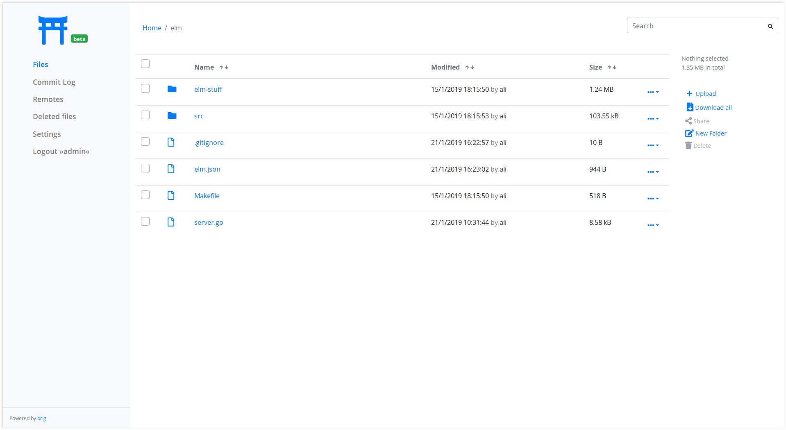

.. _features-page:

Features
========

.. note::

    The featuers below are actually available, but before version 1.0.0 we
    won't give any guarantees regarding stability or edge cases. Your mileage
    may vary currently.

Encrypted and compression built-in
----------------------------------

* All data is encrypted during storage and transport using AES-256 in GCM mode.
* Optional compression algorithm is selected based on the file type.
* Hints can be given to change the default algorithm for certain or all files.
* Keys are stored as part of the metadata during synchronisation.

Easy Version control
--------------------

* Simplified ``git``-like version control only limited by your storage space.
* Synchronization algorithm that can handle `moved files
  <https://git.wiki.kernel.org/index.php/Git_FAQ#Why_does_Git_not_.22track.22_renames.3F>`_
  and `empty directories
  <https://git.wiki.kernel.org/index.php/Git_FAQ#Can_I_add_empty_directories.3F>`_
  and files.
* Auto-updating facility that will sync on any change.
* Configurable conflict handling.

Separation between data and metadata
------------------------------------

* Your data does not need to be stored on the device you are currently using.
* Pin the data you want to use to your local storage. Every repository acts as
  cache of all the files you have access to.
* Keep a range of versions cached locally and delete older versions if they
  exceed a quota.

Truly Distributed
-----------------

* No central server at all. All infrastructure is based on IPFS.
* Still, central architectures can be build with ``brig``.
* Simple user identification and discovery.
* You do not store data you don't want to store. Pin what you need,
  fetch the rest from the network on request.

FUSE filesystem
---------------

* FUSE filesystem mirrors your data to a local directory.
* Allows your normal tools to work seamlessly with brig.
* Mounts can be persisted to stay where they are.
* Not high performance, but fast enough for daily usage.

Gateway and Web UI
------------------

* Gateway to share normal HTTP/S links with other users.
* Simple UI provided to execute the typical tasks without the need of a command line.
* User and right management included.

100% Open-Source
----------------

* Completely free software under the terms of the ``AGPL``.
* Development driven by the community.
* Written in Go and Elm.

---------

Comparison with other tools
===========================

When showing ``brig`` (or any other software in general) to someone the first
question is usually something like *»But isn't there already X?«* and sometimes
even *»Why don't you just contribute to other projects?«*. This section tries
to find an answer to both questions. The answer will obviously be biased, so
take it with a fair grain of salt.

Yes, there is other software in this world. But this is always a matter of
trade offs the author of each individual package has chosen. One application
might not run on your platform, the next might not be secure enough for your
needs, the other one is proprietary or has something else that does not fit
your liking. I won't go into an exhaustive list of competitors, but more
highlight the things that are special in ``brig`` and cannot be done easily in
other systems.

I said »competitors« earlier, which is a silly term, since I don't see this as
a competition. For me it's more about giving the user a choice and improving by
adapting good ideas from other implementations. Let's list a few of those
»competitors« to give you an impression about the place of ``brig`` in the
world:

* `Syncthing <https://syncthing.net>`_: Probably conceptually the nearest
  relative. Also a peer-to-peer based filesystem, but with its own protocol.
  Focus seems to be on ease-of-use and general high quality usability. Does not
  have strong versioning. Excellent tool and battle tested.
* `Resilio <https://www.resilio.com>`_: Proprietary solution based on BitTorrent. Seems to focus on
  performance and enterprise level resilience. Being proprietary is a show stopper for me.
* `Perkeep <https://github.com/perkeep/perkeep>`_: Not focused on files, but on
  storing personal »objects«. Would be probably more interesting as a backend
  for ``brig``.
* `Upspin <https://upspin.io>`_: A global name system that glues together
  filesystems and other data storage. Could be also a backend for ``brig`` and
  is not directly targeted to end users.
* `Bazil <https://bazil.org>`_: Basically ``brig`` minus IPFS. While apparently
  discontinued it seems to have a great deal of common features with ``brig``.
  The same author also maintains the FUSE bindings of FUSE and his writeups
  helped me writing the FUSE implementation of ``brig``. Thank you very much
  for your work `@tv42 <https://github.com/tv42>`_!
* `Git LFS <https://git-lfs.github.com>`_: The large file storage extension to ``git``.
  Similar to ``brig``'s pinning in the sense that large files are replaced with links
  that will be fetched from a LFS server.
* `git annex <https://git-annex.branchable.com>`_: Extension to ``git`` that
  tracks filenames and metadata instead of file content. Has a great deal of
  powerful features but can be a bit intimidating to the end users since it does not
  seem to focus much on usability. Features like the number of minimum copies a file
  must have before you can delete it are still on ``brig``'s roadmap.

There are probably more. Some of these inspired quite a bit how ``brig`` looks
today.  So what are the unique features of ``brig`` that you would not get
easily with other tools?

* **Pinning:** The fact that not all data needs to be on the same machine as the
  ``brig`` daemon opens up interesting possibilities. Also the ability of repinning
  is something I did not see in other tools.
* **Strong versioning of big files:** High level versioning that is comparable
  to ``git``, but simplified and meant for whole-file version control (and not
  for individual diffs).

Of course there are drawbacks. Choosing ``brig`` currently means using software
that is not in widespread use. It did not go through a security audit. It is by
far not as efficient as other tools in all use cases. But many of the current hurdles
are solvable and it's just a matter of time.

The best advice I can give you: Try it out and see if it fits your use case. If
it doesn't I'm happy to hear from you and wish you all the best with another
tool.
