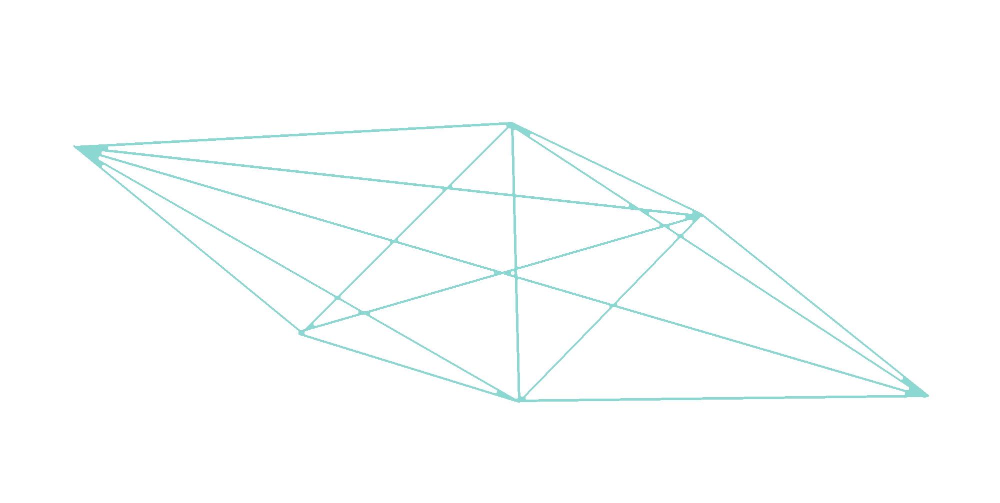

:title: brig
:author: Chris Pahl
:css: style.css
:data-transition-duration: 350
:data-perspective: 5000

.. role:: white-bg
.. role:: title-logo
.. role:: strike
.. role:: donald
.. role:: github
.. role:: www
.. role:: rtd
.. role:: underline
.. role:: small

----

.. image:: images/logo.png

:title-logo:`»brig«`

:white-bg:`Ein Werkzeug zur sicheren und verteilten`
:white-bg:`Dateisynchronisation`

.. note::

    - Viel Terminal, wenig Bling-Bling.
    - Es kommen aber viele Comics und Bilder!
    - Demo nimmt ca. 50% Zeit ein, wird also nicht so trocken.

----

Um was geht's?
==============

.. Dauer: 45min
..
.. Pro Folie: ~4 min -> Max. 10 Folien (+ kurze Folien)
.. Praktischer Teil: ca. 15-20 Minuten
.. Fragen Teil: 5-10 Minuten
..

|

* Einführung
* Das Problem
* Lösungsansatz
* Demo
* Hilfe!
* :strike:`Applaus!` Fragen?

.. note::

    Fragen bitte erst gegen Schluss stellen, weil der Vortrag so aufgebaut ist,
    dass er erst mal viele Fragen stellt. Dringende Fragen dürfen aber gleich
    gestellt werden. Sowas wie "Darf ich mal auf's Klo?".

----

Wer ist'n das?
==============

.. note::

    - Open Source Entwickler (rmlint)
    - Aus dieser Hochschule.
    - Vollzeit München.
    - Wer ich bin, ist ja eigentlich unwichtig…
      Darum geht's in dem Vortrag auch nicht.
    - Wer mehr über mich wissen will, darf gern nachher fragen.

|

**Chris Pahl.**

|
|

:small:`Wer mehr über mich wissen will:`

:small:`https://sahib.github.io`

----

Es war einmal…
==============

|

.. note::

    - Dann mal rein ins Thema...
    - Titel wird erklärt: sicher, dezentral, synchronisation
    - Unterscheidung: Synchronisieren / Austauschen
    - Umfrage: Wer benutzt welche Tools zum Synchronisieren/Austauschen?

.. image:: images/dropbox.png

----

Das Problem
===========

.. note::

    - Ihr erwartet jetzt sicherlich, dass ich euch sage was schlecht dran ist.
    - Dateiaustausch ist eine Art Babel: Jeder benutzt was anderes.
    - Am längsten dauert der Handshake bis man sich auf's Tool geeinigt hat.
    - Hyperlinks sind möglich, aber machen halt abhängig von einem Hersteller.

.. image:: images/xkcd-file-transfer.png
    :width: 75%

----

Geht es anders?
===============

Dinge die Dateiaustausch sein :underline:`sollte`:

|

* Einfach.
* Sicher.
* Schnell.
* Versioniert.
* Dezentral.
* Frei.

.. note::

    ...und außerdem: Spiel, Spaß, Spannung und Schokolade sollte drin sein.

    Viele Buzzwords. Und viele davon widersprechen sich auch noch.

    * Einfach: User Discovery, FUSE Filesystem, ist kompatibel, nervt nicht.
    * Sicher: Daten sind stets verschlüsselt.
    * Versioniert: Zusammenarbeit wird möglich, keine revisions filenames mehr.
    * Schnell: Eigentlich optional, aber Video Streaming ist nett.
    * Dezentral: Datenhoheit. Dropbox hinterlässt ein schlechten Nachgeschmack.

----

Das Babel der Dateien
=====================

.. note::

    - Ja, die lösung ist also ganz einfach... man schreibt einfach ein Tool
      das alles richtig macht, jeder nutzt das und gut ist.
    - Randall Munroe, der xkcd Autor sagt nein.

.. image:: images/xkcd-standards.png
   :width: 110%

----

Aber, aber…
===========

**Ja**, es gibt schon einige dezentrale Tools.

.. image:: images/other-tools.png
   :width: 120%
   :class: inline

* Anderer Fokus
* Andere Basis
* Andere Features
* Gleiches Ziel.

:small:`(Siehe: https://brig.readtheodocs.org/comparison.html)`

.. note::

    - So Vergleichdiskussion sind müßig und können den ganzen
      Tag dauern, ohne dass am Ende was dabei rauskommt...
    - nextCloud kann man hier in gewissen Sinne auch nennen ("dezentral")

    Jetzt machen wir hier gedanklich mal einen Cut.

----

:data-rotate: 90

Dezentralität
=============

.. note::

    - Unterschied zu anderen Tools in 3-4 Folien.
    - Was heißt jetzt eigentlich dezentral?
    - ähnlich ausgelegt wie git. (git kennt jeder?)
    - Problem: Beide müssen zur selben Zeit online sein.

----

:class: small-list

:data-rotate: 180

Nutzermanagement
================

.. note::

    - Email bzw. Jabber ID ähnlich.

|

.. image:: images/id.png
   :width: 100%

|
|

Nutzen:
-------

- Resourcen und Domains zur Discovery.
- Später :small:`(optionale)` E-Mail Authentifizierung.

----

:data-rotate: 270

Versionierung
-------------

.. note::

   - brig = git - diff
   - versionierung hilft im Alltag, aber git ist normal nicht tauglich.
   - Man braucht keine diffs. Ein Tool sollte das möglichst "einfach so" machen.

----

:data-rotate: 360

Pinning
=======

.. note::

    - Nachbereitung.
    - Komplette Separation von Daten und Metadaten.

|
|

.. image:: images/pin.png
    :width: 40%

----

IPFS
====

.. image:: images/ipfs.png

»Inter-Planetary-File-System«

.. note::

    - Milchmädchen: Ein Entwickler -> viele Buzzwords -> Nö.
    - Ist wie beim Trinken: Man braucht eine gute Basis.
    - Interplanetary Filesystem. Das ist wörtlich zu verstehen.
    - Hat schon mal jemand davon gehört?
    - Das ganze soll eine Art für das heutige Internet werden.

----

Was kann das so?
================

|

.. code-block:: bash

    $ echo 'Hallo Augsburg!' | ipfs add
    added QmbLr7bEQkC85EEGEmQk42dLz25VBy2L6iHyZQu

|
|

.. code-block:: bash

    $ ipfs cat QmbLr7bEQkC85EEGEmQk42dLz25VBy2L6iHyZQu
    Hallo Augsburg!

.. note::

    Vorteil: Ganz ohne zentralen Server.

    Nachteil: Kann bereits zum filesharing benutzt werden,
    aber nur sehr rudiemntär.

----

»brig«
======

.. note::

    - Zurück zum Thema.
    - Name erklären:
        - Zweimaster, wendig, leichtgewichtig, verteilt Datenströme.
        - ähnlich wie git, ist kurz.

.. image:: images/tux.png
    :class: img-tux
    :width: 25%

.. image:: images/gopher.png
    :class: img-gopher
    :width: 33%

* Hash Nanny für ipfs.
* In ``Go`` geschrieben.
* **Zielgruppe:** Linux User. Erstmal.

|

Entwicklungsgeschichte:
-----------------------

* Ende 2015: *Masterprojekt.*
* Ende 2016: *Pausiert.*
* Ende 2017: *Hobbyprojekt.*

----

Was ist das Ziel?
=================

|

.. image:: images/donald.png
   :align: center
   :width: 50%

|

:donald:`MAKE FILE SYNCING GREAT AGAIN!`

.. note::

    We will build a wall around the cloud.
    It will be tremendous. Great stuff.

----

:class: small-list

Ne, jetzt ernsthaft…
====================

- Balance zwischen Sicherheit und Usability.
- Effizienz ist nett, aber kein primäter Fokus.
- Kompatibilität zu gewohnten Konzepten.
- Komplexität hinter einem einfachen Interface.

.. note::

    Natürlich kann kein Tool gleichzeitig einfach zu benutzen, sicher und
    effizient sein. Es soll eine Balance zwischen Benutzbarkeit und Sicherheit
    geben - die Effizienz (hat zumindest momentan) eher drunter gelitten.

    brig macht an sich nichts neues.
    Aber wie beim Kochen macht die Kombi das Gericht.

    Siehe Demo.

----

:class: small-list

Workflow
========

.. note::

    - Synchronisieren kleines Ein mal Eins
    - Ein Tag aus dem Leben einer Datei.

* Initialer Setup :small:`(nur einmal)`
* Remotes finden & hinzufügen :small:`(nur einmal)`
* Diff anzeigen :small:`(optional)`
* Synchronisieren
* Konflikte beheben

----

:data-scale: 0.5

Demo
----

.. note::

     - Imperial March Musik
     - Big buck bunny

.. code-block:: bash

    $ brig mv raiders twix
    # sonst ändert sich aber nix.

----

Disclaimer: Sicherheit?
=======================

.. note::

    Wenn ich sagen würde, dass »brig« sicher ist, dann heißt das eigentlich
    nur dass ich beim Schreiben der Software die Absicht hatte, sichere Software zu schreiben.

    Und selbst wenn ich das geschafft hätte, dann kann man das Tool sicher benutzen,
    aber jemand könnte immer noch an deinen ungelockten PC gehen... (uvm)

|

.. image:: images/xkcd-security.png
    :width: 110%

----

Hilfe? Erwünscht.
=================

.. note::

    Problem: Man macht ein Release und kriegt 20 Feature Requests,
    mit teils total widersprüchlichen Anforderungen.
    Das artet in Feature-itis aus.

    Am Ende steht man mit eine Software da, die Kaffee kochen kann,
    dafür aber nur so mittel und dessen Name mit "j" beginnt.

Mithilfe via **Experience Reports.**

.. image:: images/binocs.png
    :class: binocs
    :width: 50%

|

Und wie?
--------

- Bug reports.
- Pull requests.
- **Keine** Feature Requests!

----

Roadmap
=======

:class: small-list

- Selektives Sharing.
- Gateway für Hyperlinks.
- Shelf Instances.
- :small:`(optional)` Autosync.
- Performance, Dokumentation...

|

|

**Hauptproblem:** Nur ein Entwickler.

.. note::

    ... und der arbeitet nen Vollzeitjob.

    Features die noch kommen sollen:

    - Gateway zur Außenwelt.
    - Realtime Synchronisation.
    - Knoten, die automatisch synchroniseren (als »blessed repo« wie bei git)
    - Fingerprints als QR Code
    - Mobile Version mit simplen Dateibrowser.
    - Verbessertes User-Management.

----

Installation
============

.. note::

    - Wie kann man es ausprobieren?
    - Go vorher installieren.
    - Das ist das erste "beta" release (0.1)
    - Mit sehr viel Vorsicht benutzen.

|

.. code-block:: bash

    # Falls nötig, Go installieren:
    $ sudo pacman -S go
    $ export GOPATH=~/go

|

.. code-block:: bash

    # brig kompilieren:
    $ go get -u github.com/sahib/brig
    $ brig --version

----

Letzte Worte
=============

|

:rtd:`http://brig.rtfd.org`

:github:`github.com/sahib/brig`

:www:`http://sahib.github.io/brig/public`

|

*Fragen?*
