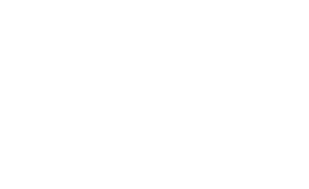

:title: brig
:author: Chris Pahl
:css: style.css
:data-transition-duration: 350

.. role:: white-bg
.. role:: title-logo
.. role:: strike
.. role:: donald
.. role:: github
.. role:: underline
.. role:: small

----

.. image:: images/logo.png

:title-logo:`»brig«`

:white-bg:`Ein Werkzeug zur sicheren und verteilten`
:white-bg:`Dateisynchronisation`

.. note::

    Stil: Dummer Slapstick Humor ala Nackte Kanone zur Aufmerksamkeitssteigerung.

----

Um was geht's?
==============

.. Dauer: 40min
..
.. Pro Folie: ~4 min -> Max. 10 Folien (+ kurze Folien)
.. Praktischer Teil: ca. 15-20 Minuten
.. Fragen Teil: 5-10 Minuten
..

|

* Einführung
* Das Problem
* Lösungsansatz
* Demo
* :strike:`Applaus!` Fragen?
* Hilfe!

.. note::

    Fragen bitte erst gegen Schluss stellen, weil der Vortrag so aufgebaut ist,
    dass er erst mal viele Fragen stellt. Dringende Fragen dürfen aber gleich
    gestellt werden. Sowas wie "Darf ich mal auf's Klo?".

----

Wer ist'n das?
==============

.. note::

    Open Source Entwickler. Aus dieser Hochschule.
    Vollzeit München.

    rmlint

    Wer ich bin, ist ja eigentlich unwichtig…
    Darum geht's in dem Vortrag auch nicht.

    Ich bin der Entwickler.

|

**Chris Pahl**

|
|

Wer mehr über mich wissen will:

    https://sahib.github.io

----

Es war einmal…
==============

|

.. note::

    Umfrage: Wer benutzt welche Tools zum Synchronisieren/Austauschen?

    Unterscheidung: Synchronisieren / Austauschen

.. image:: images/dropbox.png

----

Das Problem
===========

.. note::

    Dateiaustausch ist eine Art Babel.

.. image:: images/xkcd-file-transfer.png
    :width: 75%

----

Was lernen wir daraus?
======================

Dinge die Dateiaustausch sein :underline:`sollte`:

|

* Einfach.
* Sicher.
* Versioniert.
* Schnell.
* Dezentral.
* Frei.

.. note::

    Einfach: User Discovery, FUSE Filesystem, ist kompatibel, nervt nicht.
    Sicher: Daten sind stets verschlüsselt.
    Versioniert: Zusammenarbeit wird möglich.
    Schnell: Eigentlich optional, aber Video Streaming ist nett.
    Dezentral: Datenhoheit.

.. einbindung zu sowas wie keybase/existierende login systeme?

----

Das Babel der Dateien
=====================

.. image:: images/xkcd-standards.png
   :width: 110%

----

Aber, aber…
===========

…Ja, es gibt schon einige dezentrale Tools.

.. image:: images/other-tools.png
   :width: 120%
   :class: inline

* Anderer Fokus
* Andere Basis
* Andere Features
* Gleiches Ziel.

:small:`(Siehe: https://brig.readtheodocs.org/comparison.html)`

.. note::

    So Vergleichdiskussion sind müßig und können den ganzen
    Tag dauern, ohne dass am Ende was dabei rauskommt.
    ...

    Jetzt machen wir hier gedanklich mal einen Cut.

----

IPFS
====

.. image:: images/ipfs.png

»Inter-Planetary-File-System«

.. note::

    Interplanetary Filesystem. Das ist wörtlich zu verstehen.

----

Und was kann das so?
====================

|

.. code-block:: bash

    $ echo 'Hallo Augsburg!' | ipfs add
    added QmbLr7bEQkC85EEGEmQk42dLz25VBy2L6iHyZQu

|
|

.. code-block:: bash

    $ ipfs cat QmbLr7bEQkC85EEGEmQk42dLz25VBy2L6iHyZQu
    Hallo Augsburg!

.. note::

    Ganz ohne zentralen Server.

    TODO: (Look ma, no central server!)

    Nachteil: Kann bereits zum filesharing benutzt werden,
    aber nur sehr rudiemntär.

----

»brig«
======

.. note::

    Name erklären?

.. image:: images/tux.png
    :class: img-tux
    :width: 25%

* Hash Nanny für ipfs.
* In ``Go`` geschrieben.
* **Zielgruppe:** Linux User. Erstmal.

|

Entwicklungsgeschichte:
-----------------------

* Ende 2015: Masterprojekt.
* Ende 2016: Pausiert.
* Ende 2017: Hobbyprojekt.

----

Was ist jetzt der Fokus?
========================

|

.. image:: images/donald.png
   :align: center
   :width: 50%

|

:donald:`MAKE FILE SYNCING GREAT AGAIN!`

.. note::

    We will build a wall around the cloud.
    It will be tremendous.

----

:class: small-list

Ne, jetzt ernsthaft…
====================

- Balance zwischen Sicherheit und Usability.
- Effizienz ist nett, aber kein primäter Fokus.
- Kompatibilität zu anderen Tools.

.. note::

    Natürlich kann kein Tool gleichzeitig einfach zu benutzen, sicher und
    effizient sein. Es soll eine Balance zwischen Benutzbarkeit und Sicherheit
    geben - die Effizienz (hat zumindest momentan) eher drunter gelitten.
    Siehe Demo.

    Später evtl. sogar Interaktion mit Keybase.

----

Demo
----

.. note::

     - Imperial March Musik
     - Big buck bunny

.. code-block:: bash

    $ brig mv raiders twix
    # sonst ändert sich aber nix.

----

Einen hab ich noch!
===================

.. note::

    ``brig`` macht an sich nichts neues.
    Aber wie beim Kochen macht die Kombi das Gericht:

|
|

.. image:: images/pin.png
    :width: 40%

----

:class: small-list

Anatomie eines Nutzers
======================

.. code-block::

    donald@whitehouse.gov/ovaloffice
    vladimir@kreml.ru/sauna

|

Nutzen:
-------

- Später Optionale E-Mail Authentifizierung.
- Resourcen und Domains zur Discovery.

----

Disclaimer: Sicherheit?
=======================

.. note::

    Wenn ich sagen würde, dass »brig« sicher ist, dann hieße das nur
    das man die Software sicher benutzen kann.

|

----

Featurelücken
=============

- Stabilisierung.
- Partielle Synchronisation.
- Synchronisation von Offline-Peers.
- NAT Traversal.
- Live Updates.

|
|

**Hauptproblem:** Nur ein Entwickler.

.. note::

    ... und der arbeitet nen Vollzeitjob.

----

Ausguck
=======

.. note::

    Problem: Man machht ein Release und kriegt 20 Feature Requests,
    mit teils total widersprüchlichen Anforderungen.
    Das artet in Feature-itis aus.

    Am Ende steht man mit eine Software da, die Kaffee kochen kann,
    dafür aber nur so mittel und dessen Name mit "j" beginnt.

Mithilfe via **Experience Reports.**

.. image:: images/binocs.png
    :class: binocs
    :width: 50%

|

Roadmap
=======

- Stabiliserung
- Dokumentation
- Portierung auf andere Plattformen

.. note::

    Features die noch kommen sollen:

    - Gateway zur Außenwelt.
    - Realtime Synchronisation.
    - Knoten, die automatisch synchroniseren (als »blessed repo« wie bei git)
    - Fingerprints als QR Code
    - Mobile Version mit simplen Dateibrowser.
    - Verbessertes User-Management.

----

Installation
============

|

.. code-block:: bash

    $ go get -u github.com/sahib/brig

|

:small:`(Mehr Doku hier: https://brig.rtfd.org)`

----

Letzte Worte
=============

:github:`github.com/sahib/brig`

|

*Fragen?*
