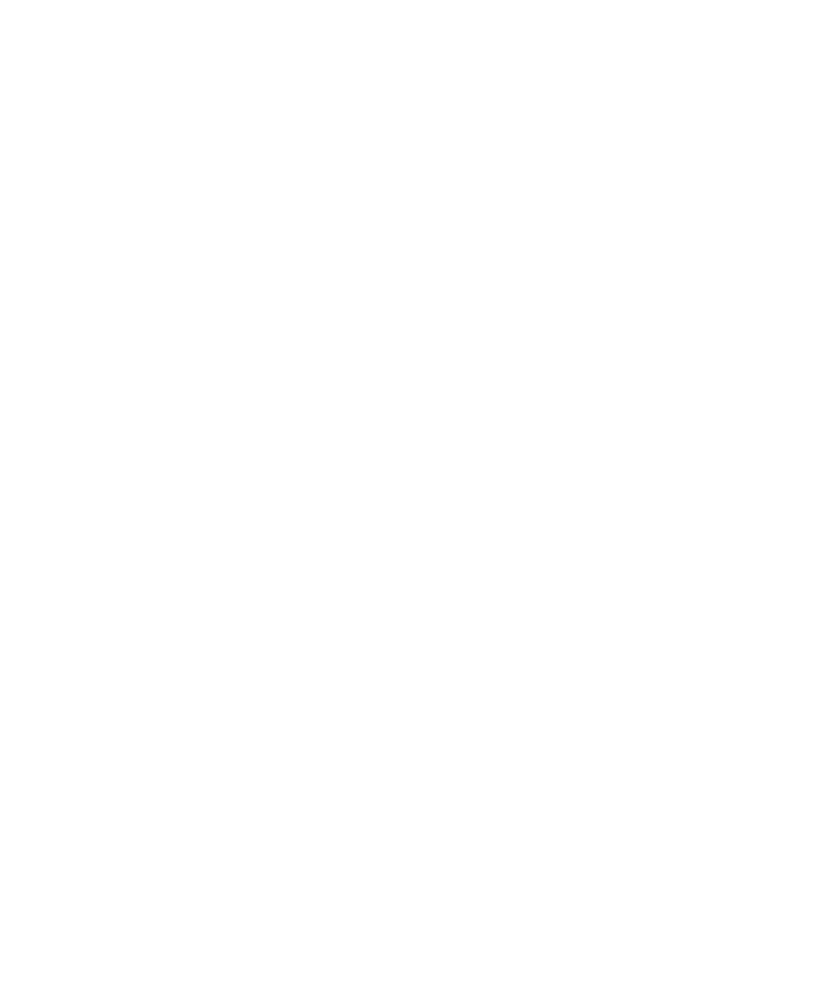
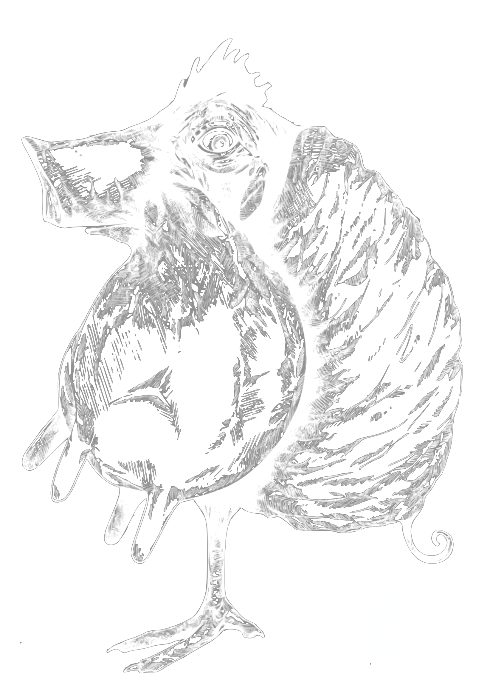

:title: brig
:author: Chris Pahl
:css: style.css
:data-transition-duration: 350
:data-perspective: 5000

.. role:: white-bg
.. role:: title-logo
.. role:: strike
.. role:: donald
.. role:: github
.. role:: www
.. role:: rtd
.. role:: underline
.. role:: small

----

.. image:: images/logo.png

:title-logo:`»brig«`

:white-bg:`Ein Werkzeug zur sicheren und verteilten`
:white-bg:`Dateisynchronisation`

.. note::

    - Dies ist eine Projektvorstellung.

    - "Unverständlichste Folie"
    - Begriffserklärung des Titels.
        - Unterscheidung: Synchronisieren / Austauschen
        - "sicher" ist schwammig
        - "dezentral" heißt ohne zentralen Server (wie git)
        - Werkzeug wie ``git``
        - Name: Zweimaster, wendig, leichtgewichtig, verteilt Datenströme.
    - Viel Terminal, wenig Bling-Bling.
    - Ihr werdet heute zu Versuchskaninchen ausgebildet.
    - Es kommen aber viele Comics und Bilder!
    - Demo nimmt ca. 50% Zeit ein, wird also nicht so trocken.

----

Um was geht's?
==============

|

* Einführung
* Das Problem
* Demo
* Was hab ich da grad gesehen?
* Hilfe!
* :strike:`Applaus!` Fragen?

.. note::

    Fragen bitte erst gegen Schluss stellen, weil der Vortrag so aufgebaut ist,
    dass er erst mal viele Fragen stellt. Dringende Fragen dürfen aber gleich
    gestellt werden. Sowas wie "Darf ich mal auf's Klo?".

    - Viel Stoff für 45 minuten, muss schnell reden, ihr werdet am Ende abgefragt.
    - Wird in der Mitte auch recht technisch.

----

Wer ist'n das?
==============

.. note::

    - Aus dieser Hochschule.
    - Vollzeit München.
    - Open Source Entwickler (rmlint)
    - Wer mehr über mich wissen will, darf gern nachher fragen.
    - Wer ich bin, ist ja eigentlich unwichtig…
      Darum geht's in dem Vortrag auch nicht.

|

**Chris Pahl.**

|
|

:small:`Wer mehr über mich wissen will:`

:small:`https://sahib.github.io`

----

Es war einmal…
==============

|

.. note::

    - Dann mal rein ins Thema...
    - Titel wird erklärt: sicher, dezentral, synchronisation
    - Umfrage: Wer benutzt...

        * Dropbox oder andere Cloud Storage Anbieter (OneDrive, Google Drive)
        * ownCloud oder nextCloud
        * Syncthing, git-annex, resilio
        * Was selbst gebasteltetes?
        * git

----

Das Problem
===========

.. note::

    - Ihr erwartet jetzt sicherlich, dass ich euch sage was schlecht dran ist.
    - Single point of failure, us unternehmen, unsicher by default, proprietär.
    - Man bräuchte sowas wie git: Man entscheidet selbst wie man es einsetzt.

    - Dateiaustausch ist eine Art Babel: Jeder benutzt was anderes.
    - Am längsten dauert der Handshake bis man sich auf's Tool geeinigt hat.
    - Hyperlinks sind möglich, aber machen halt abhängig von einem Hersteller.
    - Zusammenarbeit über Dropbox (zB an Quelltext) funktioniert nicht wirklich.

----

Was ist das Ziel?
=================

|

.. image:: images/donald.png
   :align: center
   :width: 50%

|

:donald:`MAKE FILE SYNCING GREAT AGAIN!`

.. note::

    We will build a wall around the cloud.
    It will be tremendous. Great stuff.

----

Geht das auch detaillierter?
============================

Dinge die Dateiaustausch sein :underline:`sollte`:

|

* Einfach.
* Sicher.
* Schnell.
* Versioniert.
* Dezentral.
* Frei.

.. note::

    Viele Buzzwords. Und viele davon widersprechen sich auch noch.

    * Einfach: User Discovery, FUSE Filesystem, ist kompatibel, nervt nicht.
    * Sicher: Daten sind by default stets verschlüsselt.
    * Schnell: Eigentlich optional, aber Video Streaming ist nett.
    * Versioniert: git junkie, Zusammenarbeit wird möglich, keine revisions filenames mehr.
    * Dezentral: Datenhoheit. Dropbox hinterlässt ein schlechten Nachgeschmack.

----

Aber, aber…
===========

**Ja**, es gibt schon einige dezentrale Tools.

.. image:: images/other-tools.png
   :width: 120%
   :class: inline

* Anderer Fokus
* Andere Basis
* Andere Features
* Gleiches Ziel.

:small:`(Siehe: https://brig.readtheodocs.org/comparison.html)`

.. note::

    - So Vergleichdiskussion sind müßig und können den ganzen
      Tag dauern, ohne dass am Ende was dabei rauskommt...
    - nextCloud kann man hier in gewissen Sinne auch nennen ("dezentral")
    - Mein Tool macht aber auch einige Dinge anders, die nicht direkt vergleichbar sind.

    Jetzt machen wir hier gedanklich mal einen Cut.

-----

IPFS
====

.. image:: images/ipfs.png

»Inter-Planetary-File-System«

.. note::

    - Ist wie beim Trinken: Man braucht eine gute Basis.
    - Interplanetary Filesystem. Das ist wörtlich zu verstehen.
    - Hat schon mal jemand davon gehört?
    - Das ganze soll eine Art für das heutige Internet werden.

----

Was kann das so?
================

|

.. code-block:: bash

    $ echo 'Hallo Augsburg!' | ipfs add
    added QmbLr7bEQkC85EEGEmQk42dLz25VBy2L6iHyZQu

|

.. code-block:: bash

    $ ipfs cat QmbLr7bEQkC85EEGEmQk42dLz25VBy2L6iHyZQu
    Hallo Augsburg!

.. note::

    Vorteil: Ganz ohne zentralen Server.

    Nachteil: Kann bereits zum filesharing benutzt werden,
    aber nur sehr rudiemntär.

|

.. code-block:: bash

    $ ipfs id -f '<id>\n'
    QmeLNNcryy9Ky1dXnfnEPaDQ2KuJ6yafaSRZssjQ83ie84

----

»brig«
======

.. image:: images/gopher.png
    :class: img-gopher
    :width: 33%

* Hash Nanny für ipfs.
* In ``Go`` geschrieben.
* **Zielgruppe:** Linux User. Erstmal.

|

Entwicklungsgeschichte:
-----------------------

* Ende 2015: *Masterprojekt.*
* Ende 2016: *Pausiert.*
* Ende 2017: *Hobbyprojekt.*
* Erster Beta Release heute!

.. note::

    - Betonung auf Hash Nanny.
    - Sicher durch Verschlüsselung und Public-Key Kryptografie.
    - Das ist das erste "beta" release (0.1.0-beta) - WELTPREMIERE!
    - Mit sehr viel Vorsicht benutzen.
    - Alles kann sich auserdem noch ändern.
    - Release early, release often.

----

:class: small-list

Kurz gesagt: Fokus
==================

- Balance zwischen Sicherheit und Usability.
- Effizienz ist nett, aber kein primäter Fokus.
- Kompatibilität zu gewohnten Konzepten.
- Komplexität hinter einem einfachen Interface.

.. note::

    Natürlich kann kein Tool gleichzeitig einfach zu benutzen, sicher und
    effizient sein. Es soll eine Balance zwischen Benutzbarkeit und Sicherheit
    geben - die Effizienz (hat zumindest momentan) eher drunter gelitten.

    Siehe Demo.

----

Demo
----

.. note::

     - Imperial March Musik
     - Big buck bunny

.. code-block:: bash

    $ brig mv raiders twix
    # sonst ändert sich aber nix.

----

:class: small-list

Workflow
========

.. note::

    - Synchronisieren kleines Ein mal Eins
    - Ein Tag aus dem Leben einer Datei.

* Initialer Setup :small:`(nur einmal)`
* Remotes finden & hinzufügen :small:`(nur einmal)`
* Diff anzeigen :small:`(optional)`
* Synchronisieren
* Konflikte beheben

.. image:: images/workflow.png
   :width: 50%
   :class: workflow

----

:data-rotate: 0

Disclaimer: Sicherheit?
=======================

.. note::

    Ich hab ziemlich oft schon das Wort "sicher" benutzt.
    Wenn ich sagen würde, dass »brig« sicher ist, dann heißt das eigentlich
    nur dass ich beim Schreiben der Software die Absicht hatte, sichere Software zu schreiben.

    Es kommt auf die Angriffsvektoren an.
    Und selbst wenn ich das geschafft hätte, dann kann man das Tool sicher benutzen,
    aber jemand könnte immer noch an deinen ungelockten PC gehen... (uvm)

    Philosophie ist allgemein: Ein Schloss, dass man nur unter Mühe öffnen
    kann, benutzt kaum einer.

|

.. image:: images/xkcd-security.png
    :width: 110%

----

:data-rotate: 90

Dezentralität
=============

.. note::

    - Was heißt jetzt eigentlich dezentral?
    - Problem: Beide müssen zur selben Zeit online sein.

.. image:: images/map.png
    :width: 120%

----

:class: small-list

:data-rotate: 180

Nutzermanagement
================

.. note::

    - Ist nicht wirklich vorhanden.
    - Es gibt keine registrierten Nutzer.
    - Zwei Nutzer können den selben Displaynamen haben!
    - Aber nicht den selben Fingerprint.
    - Email bzw. Jabber ID ähnlich.

|

|
|

Nutzen:
-------

- Resourcen und Domains zur Discovery.
- Später :small:`(optionale)` E-Mail Authentifizierung.

----

:data-rotate: 270

Versionierung
-------------

.. image:: images/mona.png
   :width: 100%

.. note::

   - brig = git - diff
   - versionierung hilft im Alltag, aber git ist normal nicht tauglich.
   - Man braucht keine diffs. Ein Tool sollte das möglichst "einfach so" machen.

----

:data-rotate: 360

Pinning
=======

.. note::

    - Nachbereitung.
    - Komplette Separation von Daten und Metadaten.

|
|

----

Roadmap
=======

:class: small-list

- Selektives Sharing.
- Gateway für Hyperlinks.
- Archive Instances.
- :small:`(optional)` Autosync.
- Performance, mehr Dokumentation...

|

|

**Hauptproblem:** Nur ein Entwickler.

.. note::

    ... und der arbeitet nen Vollzeitjob.

    Keine gute Basis für eine stabile Weiterentwicklung.

    Features die noch kommen sollen:

    - Knoten, die automatisch synchroniseren (als »blessed repo« wie bei git)
    - Fingerprints als QR Code
    - Mobile Version mit simplen Dateibrowser.
    - Verbessertes User-Management.

----

:id: help-slide

Hilfe? Erwünscht.
=================

.. note::

    Problem: Man macht ein Release und kriegt 20 Feature Requests,
    mit teils total widersprüchlichen Anforderungen.
    Das artet in Feature-itis aus (-> Wollmilchsau)

    Am Ende steht man mit eine Software da, die Kaffee kochen kann,
    dafür aber nur so mittel und dessen Name mit "j" beginnt.
    (Müsst ihr mal drauf aufpassen... jDownloader, jQuery, java)

    Experience Reports:

    - Fokus auf Problemen, nicht auf Lösungen.
    - Was ihr tun wolltet
    - Was ihr eigentlich gemacht/erwartet habt
    - Warum das nicht so ganz funktioniert hat

Mithilfe via **Experience Reports.**

1. Was habt ihr gemacht?
2. Was habt ihr erwartet?
3. Warum hat das nicht funktioniert?

|

Und sonst?
----------

- Bug reports. (``brig bug``)
- Pull requests.
- **Keine** Feature Requests!

----

Probem gelöst?
==============

.. note::

    Sagt ihr es mir...

    - Ja, die Lösung ist also ganz einfach... man schreibt einfach ein Tool
      das alles richtig macht, jeder nutzt das und gut ist.
    - Randall Munroe, der xkcd Autor sagt nein.
    - Abe ja, sagt ihr es mir: Waere so ein Tool hilfreich fuer manche von euch?

.. image:: images/xkcd-standards.png
   :width: 110%

----

Letzte Worte
=============

|

:rtd:`http://brig.rtfd.org`

:github:`github.com/sahib/brig`

:www:`http://sahib.github.io/brig/public`

|

*Fragen?*
