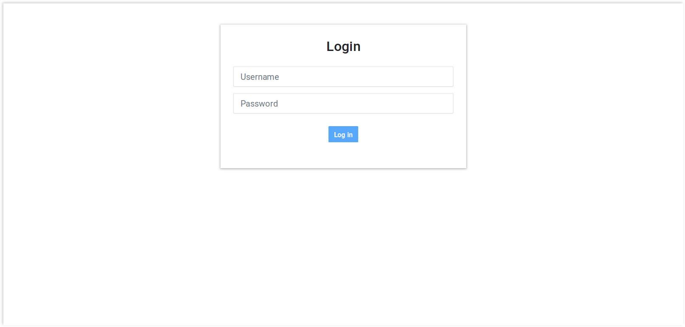
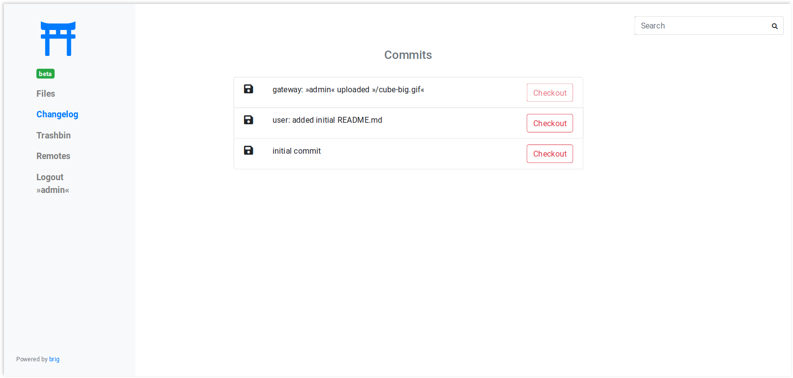
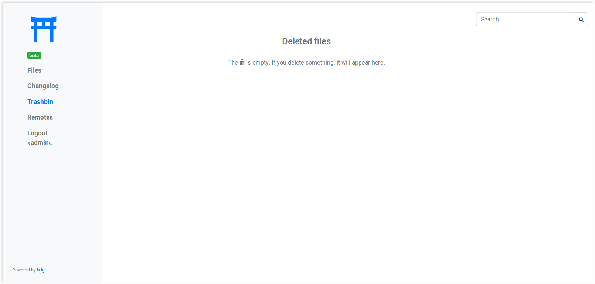
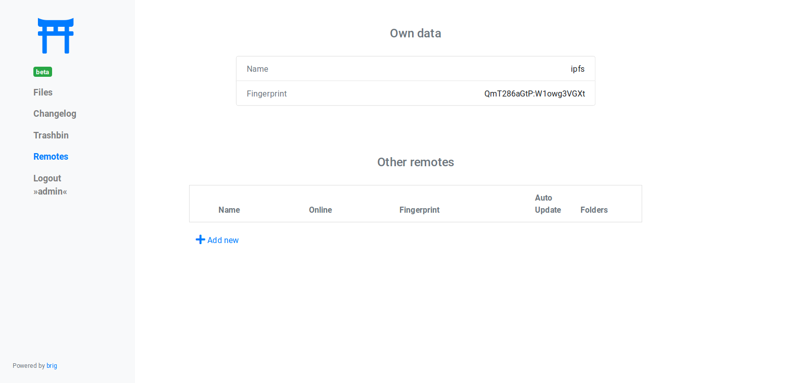
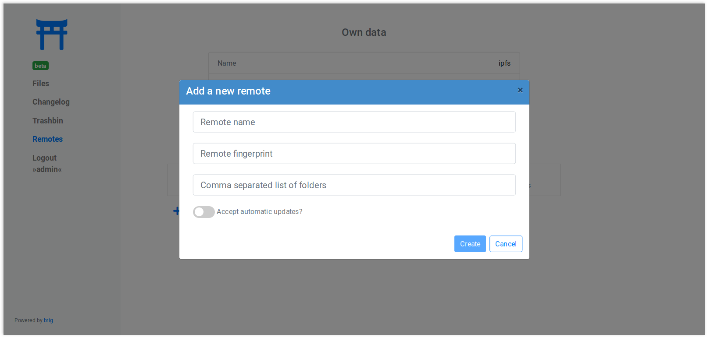

Using the gateway / UI
----------------------

Gateway Screenshots
~~~~~~~~~~~~~~~~~~~

The gateway UI consists of several tabs, which are briefly shown below to give you a short impression of it.

Login screen
^^^^^^^^^^^^

Allows you to login. You can also come back here to change the user.
It is also possible to login anonymously, as you will see below.

File Browser
^^^^^^^^^^^^

The main view. Lists the directory tree and file attributes.
Allows for modification, uploading and everything what you'd expect.

.. image:: ../_static/gateway-files.png
    :alt: Gateway files view
    :width: 66%

Changelog View
^^^^^^^^^^^^^^

A list of commits. You are able to jump back to a specific commit.

Trashbin
^^^^^^^^

A list of deleted files. If you deleted something you will be able to get it back here.

Remote List
^^^^^^^^^^^

If your user is privileged enough, you can see and edit the list of remotes and
adjust settings in it.

Remote Add Dialog
^^^^^^^^^^^^^^^^^

A sample dialog. The UI uses many of them.

---------

Introduction
~~~~~~~~~~~~

Many users will not run ``brig`` themselves, so you won't be able to ``brig
sync`` with them. Chances are that you still want to send or present them your
files without too much hassle. ``brig`` features a *Gateway* to HTTP(S), which
comes particularly handy if you happen to run a public server and/or want to
provide a GUI to your users. It also includes an easy to use UI that is enabled
by default.

Before you do anything, you need to a »user« to your gateway. This user is different
than remotes and describes what credentials can be used to access the gateway.
You can add add a new user like this:

.. code-block:: bash

    $ brig gateway user add admin my-password
    # or shorter:
    # brig gw u a admin my-password
    $ brig gateway user list
    NAME  FOLDERS
    admin /

The gateway is disabled by default. If you want to start it, use this command:

.. code-block:: bash

    $ brig gateway start

Without further configuration, this will create a HTTP (**not HTTPS!**) server
on port ``6001``, which can be used already. If you access it under
``http://localhost:6001`` you will see a login mask where you can log yourself
in with the credentials you entered earlier.

If you'd like to use another port than ``6001``, you can do so by setting the
respective config key:

.. code-block:: bash

    $ brig cfg set gateway.port 7777

.. note::

    You can always check the status of the gateway:

    .. code-block:: bash

        $ brig gateway status

    This will also print helpful diagnostics if something might be wrong.

The gateway can be stopped anytime with the following command:

.. code-block:: bash

    $ brig gateway stop

There is also a small helper that will print you a nice hyperlink to a certain
file called ``brig gateway url``:

.. code-block:: bash

    $ brig gateway url README.md
    http://localhost:6001/get/README.md

Folder management
~~~~~~~~~~~~~~~~~

You probably do not want to offer your files to everyone that have a link.
Therefore you can restrict access to a few folders (``/public`` for example)
for individual users. By default a user is allowed to see everything. If you want
a user that can only access the ``/public`` folder simply add him as follows:

.. code-block:: bash

    $ brig gw user add my-new-user /public

Now only the files in ``/public`` (and including ``/public`` itself) are
accessible from the gateway.

User right management
~~~~~~~~~~~~~~~~~~~~~

We already discussed the adding of a user above. There is a little more to that though.
You can add users with different rights. In total there are 5 different rights currently:

* **fs.view**: View and list all files.
* **fs.edit**: Edit and create new files.
* **fs.download**: Download file content.
* **remotes.view**: View the remotes tab.
* **remotes.edit**: Edit the remotes tab.

When you add users you can give a new user a comma separated list of rights via the ``-r`` switch:

.. code-block:: bash

   $ brig gw user add my-new-user -r 'remotes.view,remotes.edit'

For your convenience there are a bunch of presets which will do the work for you in 99% of the cases:

* ``--role-admin, -a``: Add this user as admin (short for »-r 'fs.view,fs.edit,fs.download,remotes.view,remotes.edit'«)
* ``--role-editor, -b``: Add this user as collaborator (short for »-r 'fs.view,fs.edit,fs.download,remotes.view'«)
* ``--role-collaborator, -c``: Add this user as collaborator (short for »-r 'fs.view,fs.edit,fs.download'«)
* ``--role-viewer, -d``: Add this user as viewer (short for »-r 'fs.view,fs.download'«)
* ``--role-link-only, -e``: Add this user as linker (short for »-r 'fs.download'«)

Running the gateway with HTTPS
~~~~~~~~~~~~~~~~~~~~~~~~~~~~~~

By default, we run with ``http`` only. If you want to expose the gateway under
a domain to the internet you should secure it with ``https``. Since brig's
gateway might is likely not the only service you want to expose we recommend a
webserver like `Caddy`_ (which is great software in general!) that
automatically fetches certificates and reverse-proxies traffic to the gateway.
A minimal ``Caddyfile`` can look like this:

.. code-block::

    # Assumption:
    # brig gateway runs on the same server as Caddy
    # and is reachable under localhost:6001.
    your.domain.org {
        route /gateway/* {
            uri strip_prefix /gateway
            reverse_proxy http://localhost:6001
        }
    }

With this setup, your gateway would be reachable under
``https://your.domain.org/gateway``.  You can of course choose a different
route or even a sub-domain. Maybe you also want to setup compression or require
a client certificate. Refer to the Caddy documentation for more information.

.. _Caddy: https://caddyserver.com/docs/getting-started

Allowing anonymous access
~~~~~~~~~~~~~~~~~~~~~~~~~

If you want to run a public gateway (for example for a group of friends), then
you might want to enable anonymous access. In this mode you will be logged in
right away to the gateway without facing the login screen. You still have the
option to go to the login screen and become another user.

You can enable the anonymous mode like this:

.. code-block:: bash

    $ brig cfg set gateway.auth.anon_allowed true

Additionally you have to create an ``anon`` user. This allows you to define
what rights the anonymous users have and what folders they may access:

.. code-block:: bash

   # Give the anonymous users only access to /public and don't let them modify anything:
   $ brig gw u add anon anon --role-viewer /public

If you want to change the name of the ``anon`` user to something else (for whatever reason) you can do so by
setting the ``auth.anon_user`` variable. You also have to re-add the user above with the new name.

.. code-block:: bash

    $ brig cfg set gateway.auth.anon_user some_other_anon_name_that_is_not_used
